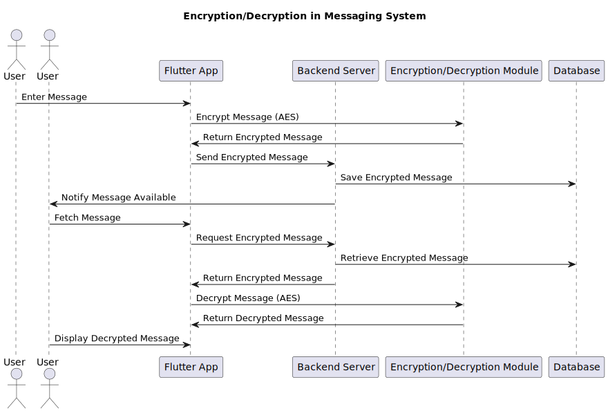

# Messaging App: Full System Documentation

## Table of Contents
1. [Project Goals](#project-goals)
2. [Technology Stack](#technology-stack)
3. [System Architecture](#system-architecture)
4. [Database Schema](#database-schema)
5. [API Documentation](#api-documentation)
6. [Security Measures](#security-measures)
7. [Scaling Plan](#scaling-plan)

---

## Project Goals

### Objectives
The goal is to develop a secure, scalable, and feature-rich messaging platform. Key objectives include:
- Real-time messaging with end-to-end encryption.
- Multimedia sharing and voice/video calls.
- A notification system with read/delivery receipts.

### Core Features
- **User Authentication**: Email-based registration and login.
- **Messaging**: Real-time one-on-one and group chats, with read receipts and message statuses.
- **Media Sharing**: Support for image, video, and document sharing.
- **Voice and Video Calls**: Secure, end-to-end encrypted calling.
- **Admin Dashboard**: Monitoring user metrics and app management.

---

## Technology Stack

### Client Side
- **Framework**: Flutter for cross-platform mobile app development.
- **Real-time Communication**: WebSockets for instant message delivery.
- **Encryption**: RSA/AES encryption to secure data during messaging.

### Backend Server
- **Framework**: NestJS or Django for handling business logic and API endpoints.
- **Database**: PostgreSQL for structured data storage.
- **Cache**: Redis for session management and quick access to frequently requested data.
- **Media Storage**: Firebase Storage or Amazon S3 for storing images, videos, and other media files.

### Additional Tools
- **Push Notifications**: Firebase Cloud Messaging (FCM) for real-time notifications.
- **Authentication**: Firebase Auth or custom token-based login for email-based authentication.
- **Cloud Infrastructure**: Google Cloud Platform (GCP) or AWS for hosting and scalability.

---

## System Architecture

### Overview
The system architecture consists of:

1. **Client Application**: Flutter-based app handling user interactions and real-time messaging through WebSocket connections.
2. **Backend API**: Built with NestJS or Django, this server manages user data, message routing, and API requests.
3. **Database Layer**: PostgreSQL to store structured data, with optimized indexing for search efficiency.
4. **Cache Layer**: Redis, for session management and caching frequent data, like user online status.
5. **Media Storage**: Firebase Storage or Amazon S3 for handling media uploads and secure access.
6. **Push Notification System**: Firebase Cloud Messaging to manage message notifications, calls, and other alerts.

### Architecture Diagram


---

## Database Schema

### Key Entities and Relationships

1. **User**
   - Stores user information, including email, profile picture, and online status.
   - Columns: `userId`, `email`, `profilePicture`, `isOnline`.

2. **Chat**
   - Represents a conversation between users, supporting both one-on-one and group chats.
   - Columns: `chatId`, `isGroup`, `createdAt`.

3. **Message**
   - Stores individual messages, with fields for sender, recipient, content, and status (sent, delivered, read).
   - Columns: `messageId`, `chatId`, `senderId`, `receiverId`, `content`, `timestamp`, `status`.

4. **Group**
   - For group chats, with details about group members and admin.
   - Columns: `groupId`, `groupName`, `adminId`, `memberIds`.

5. **Media**
   - Stores metadata for media shared within chats.
   - Columns: `mediaId`, `messageId`, `type`, `url`, `size`.

6. **Call Log**
   - Tracks call details between users, including type and duration.
   - Columns: `callId`, `callerId`, `receiverId`, `type` (voice/video), `timestamp`, `duration`.

### Entity Relationship Diagram (ERD)


---

## API Documentation

### Authentication

#### Register
- **Endpoint**: `POST /api/auth/register`
- **Description**: Registers a new user using email verification.
- **Request Body**:
    ```json
    {
      "email": "user@example.com",
      "password": "securepassword"
    }
    ```
- **Response**:
    ```json
    {
      "userId": "abc123",
      "token": "jwt_token"
    }
    ```

#### Login
- **Endpoint**: `POST /api/auth/login`
- **Description**: Logs in a user and issues a JWT token.
- **Request Body**:
    ```json
    {
      "email": "user@example.com",
      "password": "securepassword"
    }
    ```

### Messaging

#### Send Message
- **Endpoint**: `POST /api/messages/send`
- **Description**: Sends a message from one user to another or a group.
- **Request Body**:
    ```json
    {
      "senderId": "abc123",
      "receiverId": "xyz456",
      "content": "Hello!"
    }
    ```
- **Response**:
    ```json
    {
      "messageId": "msg789",
      "status": "sent"
    }
    ```

#### Get Messages
- **Endpoint**: `GET /api/messages/{chatId}`
- **Description**: Retrieves messages for a specific chat.
- **Response**:
    ```json
    [
      {
        "messageId": "msg789",
        "senderId": "abc123",
        "content": "Hello!",
        "timestamp": "2024-01-01T10:00:00Z",
        "status": "read"
      }
    ]
    ```

### Media Upload
- **Endpoint**: `POST /api/media/upload`
- **Description**: Uploads media files to Firebase Storage or Amazon S3.
- **Request Body**: File in multipart/form-data.
- **Response**:
    ```json
    {
      "mediaId": "media456",
      "url": "https://storage-service.com/media456.jpg"
    }
    ```

### Sequence Digram (Message Sending Flow)
.svg)

---

## Security Measures

### Encryption
- **End-to-End Encryption**: Messages and calls are encrypted using RSA/AES for privacy.
- **Data in Transit**: Encrypted with HTTPS to protect data integrity.

### Authentication
- **JWT Token**: Used for secure sessions.
- **Email Verification**: Users register using email and password, with optional email verification for added security.

### Privacy and Compliance
- **GDPR Compliance**: Data retention policies and user data management meet GDPR standards.



---

## Scaling Plan

### Database Sharding
As user and message data grows, we’ll implement sharding on the message and user tables to distribute load effectively.

### Load Balancing
Use load balancing across multiple servers to ensure high availability and reduce latency.

### Caching
Redis caching for frequently accessed data (e.g., session management).

### Backup Strategy
Automated daily backups of PostgreSQL databases and Firebase Storage to prevent data loss.

### Deployment Diagram 


---

## UML Class Diagram

### Key Classes

1. **User**
   - **Attributes**: `userId`, `email`, `profilePicture`, `isOnline`.
   - **Methods**: `sendMessage()`, `makeCall()`.

2. **Chat**
   - **Attributes**: `chatId`, `isGroup`, `createdAt`.
   - **Methods**: `addMessage()`, `getMessages()`.

3. **Message**
   - **Attributes**: `messageId`, `chatId`, `senderId`, `receiverId`, `content`, `timestamp`, `status`.
   - **Methods**: `send()`, `markAsRead()`.

4. **Media**
   - **Attributes**: `mediaId`, `messageId`, `type`, `url`, `size`.
   - **Methods**: `uploadMedia()`, `deleteMedia()`.


---
---

# UI/UX Design Specifications

## Design Guidelines

*(Recomendations but you are open to select your best)*

- **Primary Colors**: #0084ff (Blue), #ffffff (White), #f0f0f0 (Light Gray)
- **Font**: San Francisco or similar
- **Icons**: Material Design Icons (or custom icons as needed)

---

## Screens

### 1. Welcome Screen

- **Purpose**: Display a warm welcome to users and prompt them to sign in or register.
- **Elements**:
  - **Logo**: Top center.
  - **App Tagline**: Under the logo, e.g., “Secure messaging for everyone.”
  - **Buttons**:
    - **Sign In**: Leads to the Sign-In screen.
    - **Register**: Leads to the Registration screen.

---

### 2. Registration Screen

- **Purpose**: Allow new users to create an account using email.
- **Elements**:
  - **Email Field**: Input field with “Email Address” placeholder.
  - **Password Field**: Secure input with “Password” placeholder.
  - **Confirm Password**: Secure input with “Confirm Password” placeholder.
  - **Register Button**: CTA to create an account.
  - **Sign In Redirect**: Text link, “Already have an account?” leading to Sign-In.

---

### 3. Sign-In Screen

- **Purpose**: For existing users to log in using email.
- **Elements**:
  - **Email Field**: Input for email.
  - **Password Field**: Secure input for password.
  - **Sign In Button**: CTA to log in.
  - **Forgot Password**: Link to Password Recovery Screen.

---

### 4. Password Recovery Screen

- **Purpose**: Let users reset their password via email.
- **Elements**:
  - **Email Field**: Input to enter the registered email.
  - **Reset Password Button**: CTA to initiate reset process.

---

### 5. Home Screen (Chat List)

- **Purpose**: Display the user’s active chats with recent messages and unread indicators.
- **Elements**:
  - **Chat List**: Each chat has:
    - **Contact Name**: Bold text.
    - **Last Message Preview**: Gray text.
    - **Timestamp**: Right-aligned.
    - **Unread Indicator**: Small dot or badge for unread messages.
  - **Search Bar**: Top bar for searching conversations.
  - **New Chat Button**: Icon to initiate new chat.

---

### 6. Chat Screen

- **Purpose**: Display chat messages and facilitate user interaction.
- **Elements**:
  - **Messages Area**: Bubbles for sent and received messages.
  - **Text Input Field**: Input for typing messages.
  - **Send Button**: Icon to send message.
  - **Attachment Icon**: For selecting media/files.
  - **Back Button**: Top left for navigation back to Home.

---

### 7. Contacts Screen

- **Purpose**: Display and manage contacts for new conversations.
- **Elements**:
  - **Contacts List**: Display contacts using the app.
  - **Add Contact**: Icon or button to add a new contact manually.
  - **Search Bar**: For filtering contacts.

---

### 8. Settings Screen

- **Purpose**: Customize app preferences, security, and account information.
- **Sections**:
  - **Account Settings**: Change email, password, and profile info.
  - **Security**: Configure two-factor authentication.
  - **Notifications**: Manage message notifications.
  - **Privacy**: Configure privacy preferences.
  - **Backup and Restore**: Options for chat backups.
  - **Delete Account**: Option to permanently delete the account.

---

### 9. User Profile Screen

- **Purpose**: Update user information.
- **Elements**:
  - **Profile Picture**: Editable by tapping.
  - **Name**: Editable text field for display name.
  - **Email**: Non-editable text field.

---

### 10. Group Chat Management Screens

#### Group Info Screen
- **Purpose**: Show group details and manage members.
- **Elements**:
  - **Group Name**: Editable text.
  - **Member List**: Display all group members.
  - **Media**: Recent media shared in the group.
  - **Add Member**: Button for admins to add members.

#### Create Group Screen
- **Purpose**: Create a new group with selected contacts.
- **Elements**:
  - **Contact Selection**: Checkbox for each contact.
  - **Group Name**: Input field.
  - **Create Button**: CTA to finalize group creation.

---

### 11. Media and Attachment Screens

#### Media Viewer
- **Purpose**: Full-screen view of images or videos.
- **Elements**:
  - **Zoom Controls**: Pinch-to-zoom or buttons.
  - **Download Button**: For saving media.

#### Attachment Screen
- **Purpose**: Allow users to select attachments.
- **Elements**:
  - **Attachment Types**: Options for photo, video, document, location.

---

### 12. Search Screen

- **Purpose**: Search contacts, messages, and media.
- **Elements**:
  - **Search Input**: Top bar.
  - **Filter Options**: Buttons for “Contacts,” “Messages,” and “Media.”

---

## Notes for Designers

1. **Interactive Elements**: Ensure buttons, input fields, and icons are distinguishable.
2. **Consistent Layouts**: Maintain consistent padding, margins, and font sizes across screens.
3. **Scalable Design**: Make elements responsive for mobile and tablet views.
4. **Accessibility**: Use readable font sizes, color contrasts, and test with screen readers.

---
